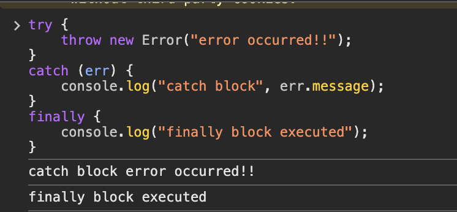

<h1>Introduction to Error handling and Promise object in javascript</h1>

## Introduction

javascript는 몇년 전에 재밌어서 한참 공부하다 한동안 파이썬과 그나마 그 다음으로 C++정도만 해볼 일이 있어서 지식이 증발한 느낌이 많이 들었다. 그래서 얼마전부터 개발에 착수한 웹게임개발 과정에서도 js 지식의 빈틈이 잔실수를 만들기도 했고, 개발을 지체 시킨 적도 있다. 그래서 차근차근 조금 빈틈이 느껴진다 싶은 부분은 다시 단단하게 만드는 차원에서 몇몇 개념을 다시 정리해본다.

#### 1\. try / catch 알아보기

js에서의 에러발생 및 흐름에 있어서 중추적인 부분 중 하나인 try / catch는 이 2가지에 더해 finally까지 있다. 보통 아래 코드처럼 error 발생 대상이 될 수 있는 코드는 try block, 에러 발생 시 이를 처리할 코드는 catch block, 한번은 무조건 실행하는 부분을 finally block으로 처리한다.

```
try {
	// error 가 발생할 가능성이 있는 코드
}
catch (error) {
	// error 발생 시 이를 처리할 부분
}
finally {
	// 무조건 한번은 실행하는 부분
}
```
<br>
아래 사진처럼 error 가 발생하는 경우 catch block이 먼저 실행된 후, finally block이 실행되는 것을 확인할 수 있었다.

<br>
<!-- 
 -->


 


<!--  -->
 <!-- 위 방식도 됨  -->

<br>
error 발생을 시키는 과정에서 사용하는 Error라는 객체는 message와 stack property를 가지며, catch (err) 부분에서 파라미터로 들어온 err가 Error 객체이다. 그래서 console.log 로 출력할 때 객체명.message 형태로 error 객체의 내용을 확인한 것이다.

Error 객체의 type은 총 8개로 분화된다. MDN 문서에서는 subclass라고 명명하는데, 이는 각각의 error들이 Error.prototype을 상속받기 때문이다.

<br>

| Error Type | Description | Example |
| --- | --- | --- |
| EvalError | eval() 함수 사용 과정에서 에러 존재 시 발생 | evaluation 이 안되는 경우들 |
| RangeError | 유효하지 않은 범위 사용 시 발생 | array 함수에서 크기를 -1로 설정 |
| ReferenceError | 참조오류 시 발생 | 선언하지 않는 변수(or 함수)사용 |
| SyntaxError | 문법오류 시 발생 | 말그대로 문법 틀린 경우들 |
| TypeError | type이 유효하지 않을때 발생 | 지정된 타입을 사용하지 않은 경우들 |
| URIError | encodeURI() 또는 decodeURI() 과정에서 형식오류로 발생 | URI 형식을 지키지 않은 파라미터를 넣을때 |
| AggregateError | 여러오류를 단일오류로 wrapping 시켜 발생 | Promise.any() 에서 사용 |
| InternalError | js engine 자체에서 error 발생 | too much recursion (재귀) |

<br>
 
developer.mozilla.org(https://developer.mozilla.org/en-US/docs/Web/JavaScript/Reference/Global_Objects/Error)

#### 2\. Promise

promise도 처음 공부할 땐 쉽게 받아들여지지 않던 개념이었다.

a) Promise의 등장배경

원래 자바스크립트는 비동기처리를 위해 callback 함수를 활용했었는데, 이러한 전통적인 콜백함수 패턴은 콜백헬(callback hell)을 일으켜 코드의 가독성을 나쁘게 하고, 비동기처리과정에서 발생한 에러핸들링이 복잡하여 ES6에서 또 다른 패턴인 promise가 도입되었다.

에러 핸들링이 복잡하다는 것은, 쉽게 말하면 아래 적힌 코드처럼 콜백함수로 throw new Error()를 넣은 setTimeout함수를 try block 안에 넣어도, try block은 이를 찾아서 error로 판단하지 못한다.

```
try {
	setTimeout( () => { thorw new Error("에러에용"); }, 0); // 0ms로 설정, 실제는 20m정도
}
catch (err) {
	console.log(err.message); // callback func내부의 error를 잡지못함
}
```

<br>

왜 이런 현상이 벌어지냐? 하면 콜스택(컨텍스트스택)에서 가장 밑에 전역컨텍스트가 push되고, 그 위에 setTimeout 함수의 실행컨텍스트가 push된다. setTimeout 함수의 callback은 저기 저 멀리 js엔진 밖의 태스크큐로 push되고, 콜스택은 setTimeout -> 전역 컨텍스트 순서로 pop된다. 그럼 콜스택이 비어있는 것을 확인하고,  태스크큐에 있던 callback 함수가 그제서야 콜스택에 push 되는데 그때는 이미 try / catch 문이 사용된 전역 컨택스트는 없어진 상태이다. 그러므로 callback에서 고의로 유발한 error는 솎아지지않게 되는 것이다.

<br>

b) Promise 활용법

반면 promise는 status 개념을 접목시켜서 비동기처리가 성공하면 resolve 함수, 실패하면 reject 함수를 활용하여 비동기처리를 수행한다.

밑에서 이야기하겠지만, 대표적으로 promise 함수의 성공 시, 후속메소드 중 하나인 then() 메소드를 통해 resolve를 실행하고, 실패 시 catch() 메소드를 활용하여 reject를 실행하여 에러를 처리한다.

비동기처리가 되기 전에는 promise 객체의 상태(status)가 pending으로, 처리 결과에 따라 "fullfilled" 또는 "rejected"로 나뉜다.

<br>

c) Promise then/catch/finally 후속 메소드 처리

1번에서 언급한 try, catch, finally와 사용방식이 유사하다. 기본적으로 then은 정상적인 비동기처리가 될 경우 실행을 하고, 실패할 시에는 catch, 무조건 적으로 finally를 실행하는 방식이다.

```
new Promise((resolve, reject) => { 
	if (조건) resolve("해결!");
    else reject(new Error("에러!"));
})
.then(res => console.log(res)); // if문 만족 시, 해결! 출력
.catch(rej => console.log(rej.message)); // if문 불만족 시, 에러! 출력
.finally(() => console.log("함수끝!")); // 무조건, 함수끝! 출력
```

<br>

d) Promise 체이닝

Promise 체이닝은 말이 어려워보이지 그냥 chaining을 의미한다.

위 코드에서처럼 then이 하나인 경우에는 resolve callback을 반환하지만, then이 2개 이상 필요한, 흔히 callback hell 이 연출될 상황일 때, 들여쓰기로 call back func을 반복하는 것이 아니라, .then() 키워드만 이어붙이면서 promise의 callback을 이어나갈 수 있게할 수 있는 요소이다. 

다음에는 제너레이터와 async/await 개념에 대해 공부해봐야지..


